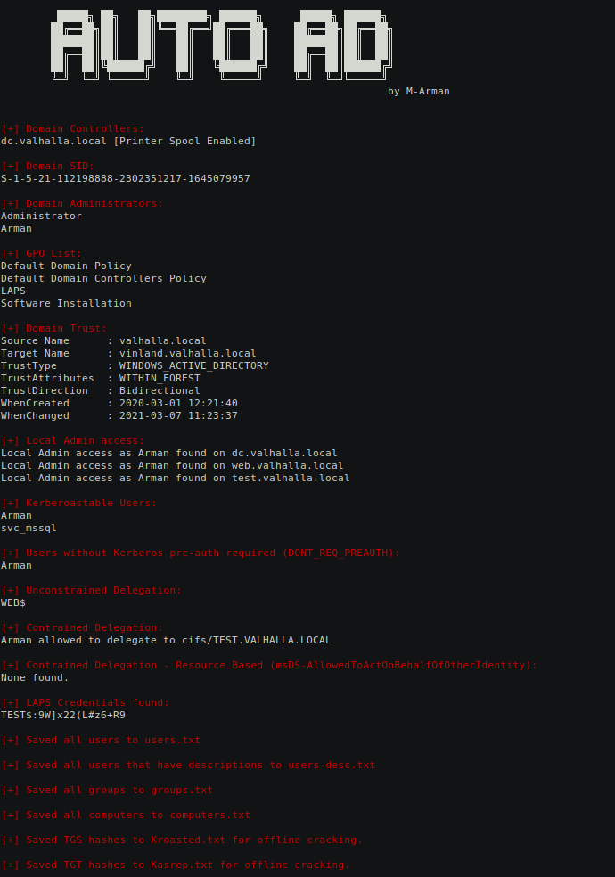

# AutoAD - Simple python script for AD enumeration

This tool was created on my spare time to help fellow penetration testers in automating the basic enumeration steps that they would do on their daily-basis job and can be useful in AD labs (CRTP/CRTE/CRTO/Offshore..etc)  

(Spoiler: this tool is far from being perfect.)

## Installation
```shell
git clone https://github.com/M-Arman/AutoAD.git
cd AutoAD
chmod +x install.sh
sudo ./install.sh
```

## Usage
```none
	    
	 █████╗ ██╗   ██╗████████╗ ██████╗      █████╗ ██████╗ 
	██╔══██╗██║   ██║╚══██╔══╝██╔═══██╗    ██╔══██╗██╔══██╗
	███████║██║   ██║   ██║   ██║   ██║    ███████║██║  ██║
	██╔══██║██║   ██║   ██║   ██║   ██║    ██╔══██║██║  ██║
	██║  ██║╚██████╔╝   ██║   ╚██████╔╝    ██║  ██║██████╔╝
	╚═╝  ╚═╝ ╚═════╝    ╚═╝    ╚═════╝     ╚═╝  ╚═╝╚═════╝ 
			                                      by M-Arman
                                                       
usage: AutoAD.py [-h] -user USERNAME -pass PASSWORD -dc-ip DC_IP -dns-mode DNS_MODE

AutoAD - Simple python script for AD enumeration

optional arguments:
  -h, --help          show this help message and exit
  -user USERNAME      Username for the account that will be used for
                      authentication. (format: user@domain.local)
  -pass PASSWORD      Password for the account that will be used for
                      authentication.
  -dc-ip DC_IP        The IP address for the domain controller that will be
                      queried for results.
  -dns-mode DNS_MODE  1= Use DC-IP as DNS server.(default)
                      2= Use system default DNS configurations.(proxychains/joined machine)
```

## Features
- [x] List Domain Controllers, Domain SID, Domain Admins.
- [x] Check for printer spool on domain controllers to be abused with printer-bug.
- [x] List Group Policy Objects (GPO).
- [x] List Domain trusts.
- [x] List Kerberoastable users.
- [x] List Unconstrained delegation enabled computers.
- [x] List Constrained delegation enabled computers/users.
- [x] Find readable LAPS credentials.
- [x] Checks for local administrator access on all domain computers as the querying user.
- [x] Output domain users, users with description, computers, groups.
- [x] Output hashes from TGS and ASREP roasting for offline cracking. (Impacket)

## Example

```./AutoAD.py -user Arman@valhalla.local -pass N0tActuallyaPassw0rd -dc-ip 192.168.110.145```
<details><summary>Screenshot</summary>
	

</details>

## Future work

- [ ] Use OOP.
- [ ] Use hash authentication.
- [ ] Replace impacket hashes dumping method.
- [ ] Exchange Servers enumeration
- [ ] MSSQL enumeration.

## License

 This program is free software: you can redistribute it and/or modify
    it under the terms of the GNU General Public License as published by
    the Free Software Foundation, either version 3 of the License, or
    (at your option) any later version.

    This program is distributed in the hope that it will be useful,
    but WITHOUT ANY WARRANTY; without even the implied warranty of
    MERCHANTABILITY or FITNESS FOR A PARTICULAR PURPOSE.  See the
    GNU General Public License for more details.

    You should have received a copy of the GNU General Public License
    along with this program.  If not, see <https://www.gnu.org/licenses/>.
